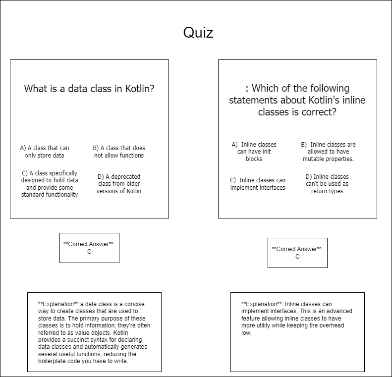
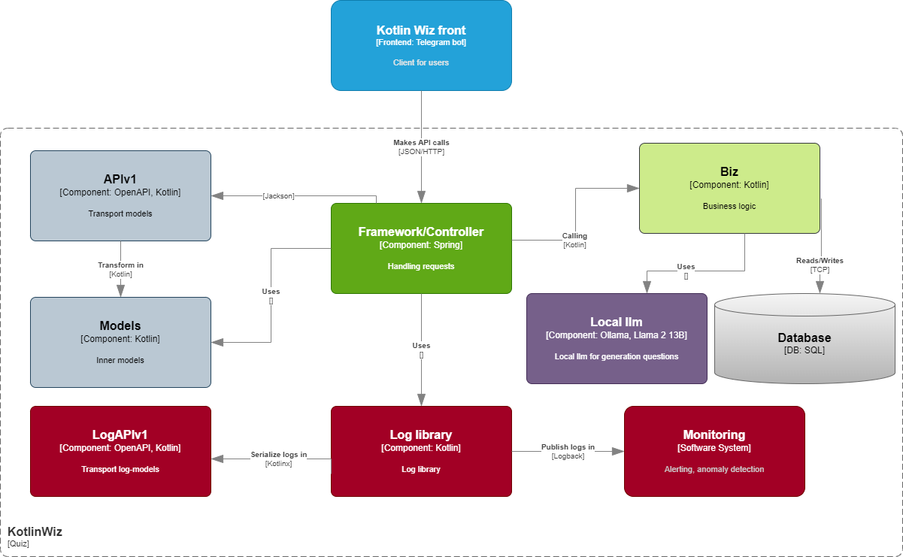

# **Project report**
### **Project's reporter:** Artyom Borisevich
### **Group number:** 202402

---
# Project name - KotlinWiz

---
# MVP overview
Application helps users master various materials. MVP - telegram bot in Kotlin with the assistance of 
an AI-powered local language model. It provides interactive learning materials, quizzes, and programming challenges 
to make learning Kotlin engaging and enjoyable.

## Features
- **Interactive Learning Sessions**: Engage with the bot to learn Kotlin concepts through interactive scenarios.
- **Quizzes**: Test your knowledge with Kotlin quizzes and get instant feedback. A leaderboard with the top scorers of the week.
- **Programming Challenges**: Take on coding challenges that help you practice and improve your Kotlin skills.
- **AI Assistance**: Get explanations and hints on Kotlin concepts with the help of local language model intelligence.

## Target Audience
The KotlinWiz is tailored for a diverse range of users who are interested in learning the Kotlin programming
language, whether they are students, developers new to Kotlin, or experienced programmers looking to refresh their skills.

Below is a more detailed breakdown of the intended target audience for this Telegram bot:

- **Beginner Programmers**: Individuals who have just started their programming journey and want to learn Kotlin as their first or one of their initial languages.
- **Java Developers**: Seasoned Java developers who are looking to transition to Kotlin due to its interoperability with Java and its increasing popularity for Android app development.
- **Android Developers**: Developers aiming to adopt or enhance their knowledge in Kotlin for Android development, given that Kotlin is now the preferred language for Android.
- **Computer Science Students**: Students currently enrolled in computer science or related courses who require a practical understanding of Kotlin for their studies or personal projects.
- **Tech Enthusiasts**: Hobbyists and tech enthusiasts who have an interest in modern programming languages and want to stay updated with the current trends.
- **Life-long Learners**: Individuals committed to continuous learning and improving their coding skills, leveraging the AI-assisted interaction that the bot provides.

### Why this app?

- Accessibility: The bot's accessibility via Telegram makes it convenient for users who frequently use the messaging platform and prefer an integrated learning experience within their communication tool of choice.
- Customization: Quiz bot could offer personalized learning paths based on the user's existing knowledge and goals.
- Integration with LLM: the use of language learning models to provide smart, contextual hints or explanations, which sets your bot apart from simple Q&A quizzes.

## Entity descriptions

---
### Primary Entity
#### Quiz Item
- Question_ID (Primary key): A unique identifier for the question.
- Question: The content of the quiz question.
- Level: The difficulty of the quiz question.
- Choices: Potential answers provided to the user.
- Correct_Answer: The index or identifier of the correct answer.
- Explanation: A brief explanation that can be provided after the answer is given.
---
### Auxiliary Entities
#### Quiz Result
- Result_ID (Primary key): A unique identifier for the quiz result record.
- User_ID: Identifier to link the results to a specific user.
- Quiz_ID: Identifier to link to the specific quiz taken.
- Score: The user's score on the quiz.
- Timestamp: When the quiz was taken.

#### User
- User_ID (Primary key): A unique identifier for each user.
- Username: The Telegram user's name or handle.
- Chat_ID: Unique chat identifier to send messages to the correct conversation.
- Language: Preferred language of the user for localization.
- State: Used to keep track of where the user is in the bot's workflow (e.g., "START", "QUIZ", etc.).

#### Conversation
- Conversation_ID (Primary key): A unique identifier for each conversation session.
- User_ID: A foreign key linked to the User's ID.
- Start_Time: The timestamp when the conversation started.
- End_Time: The timestamp when the conversation ended.

#### Message
- Message_ID (Primary key): A unique identifier for each message.
- User_ID: Identifier to link the message to a specific user.
- Content: The actual message content sent or received.
- Timestamp: When the message was sent or received.

#### Bot State
- State_ID (Primary key): A unique identifier for the bot's state.
- Description: A description of what this state represents (e.g., "WAITINGFORANSWER").
- Actions: What actions the bot should perform when in this state.

---

### API

---
### QUIZ ITEM CRUDS
1. Create Question: Endpoint: /questions
2.  Read Question: Endpoint: /questions/{questionId}
3. Update Question: Endpoint: /questions/{questionId}
4.  Delete Question:  Endpoint: /questions/{questionId}
5. Search question:  Endpoint: /questions/{searchText}

---

## Prerequisites
- Telegram account
- Basic knowledge of programming (optional, but recommended)

## Installation
1. Open Telegram and search for the KotlinWiz Bot.
2. Start a conversation by clicking on the 'Start' button.
3. Follow the on-screen instructions to begin your learning journey.

## Usage
Send a message to the bot to learn a new topic, or use commands like /quiz to start a quiz, /challenge to begin a 
programming challenge, or /help to get a list of available commands.

## Feedback and Contribution
As this is an MVP, we eagerly welcome feedback and contributions. If you have suggestions, questions, or want to contribute, please:

1. Send us feedback directly through the bot.
2. Create an issue in the repository if you encounter any problems.
3. Fork the repository and submit a pull request with your proposed changes or enhancements

---
# Sketch of the front-end presentation

---
# High level architecture

